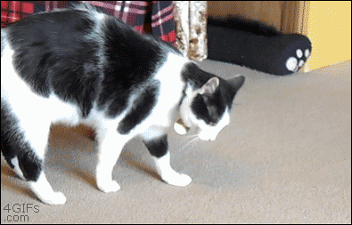

class: middle center inverse

```{r initial, echo = FALSE, cache = FALSE, results = 'hide'}
library(knitr)
options(htmltools.dir.version = FALSE, tibble.width = 60, tibble.print_min = 6)
opts_chunk$set(
  echo = FALSE, warning = FALSE, message = FALSE, comment = "#>",
  fig.path = 'figure/', cache.path = 'cache/', fig.align = 'center', 
  fig.width = 12, fig.height = 8.5, fig.show = 'hold',
  cache = TRUE, dev = 'svglite'
)
read_chunk('scripts/theme.R')
read_chunk('scripts/flights.R')
```

```{r theme-remark}
```


???

In short, I just introduce an R package for tidy temporal data analysis.

---

.left-column[
.center[
<br>
<br>
<br>

]
]
.right-column[
<br>
<br>

]

### .center[Behind fluent pipeline is [tidy data](https://tidyr.tidyverse.org/articles/tidy-data.html).]

???

Since I'm talking about data analysis in R, I cannot avoid talking about the tidyverse.

This diagram, you probably see it many times, resonates well with data scientists, because it points out the critical steps and the iterative nature of the analysis process.

You can find one of the tidyverse packages correspond to each of the modules here. The tidyverse basically helps with data analysis tidy and smooth in general.

But what this diagram doesn't tell you is they all share the same underlying data structure.

This "tidy" stage doesn't mean data cleaning, but actually means making the data in a right shape, a uniform shape that forms the basis for these three modules in this loop. Now, this kind of data shape is called "tidy data".

With the tidyverse, we have such a fluent pipeline to handle data analysis. But if you have ever done time series analysis in R, I hope this diagram resonates with you well ...

---

.left-column[
<br>
<br>
## .center[.red[time series verse]]
]
.right-column[
<br>
<br>

]

### .center[WAT!`r emo::ji("scream")`]

???

It is a messy-verse.

There are a few time series data classes in R, but all are designed purely for the modelling purpose, which means the object can be quite different from the data at the "import" stage. How to convert the raw data to model objects happen under the table. No formal and transparent organisation is provided on how to reshape the data for modelling, you'll go through such a lumpy path with luck.

Once the data is in the modelling shape, transformation and plotting are doable but not that tidy.

But this diagram only captures the workflow for relatively simple data set. If the data is more complex, for example, many series and many measurements, the diagram doesn't emphasize the difficulty enough.

This motivates the tsibble package that I'm going to talk about.

---

background-image: url(img/tsibble-model.png)
background-size: 70%
background-position: 91% 38%

.left-column[
<br>
<br>
<br>
<br>
## .center[tidyver.red[ts]]
]
.right-column[
.animated.slower.rollIn[
.pipeline[]
]
]

### .bottom[.center[Tsibble defines tidier data for temporal analysis.]]

???

The goal of the tsibble package is to define tidy data in terms of temporal contexts, that is suitable for downstream analysis, like modeling or forecasting, and reduces the friction between data and models. It turns out tsibble is tidier than tidy data. I'll explain what I mean by tidier data later.

Tsibble alone can't do everything in this whole process. A broader picture here is we hope to tidy the time series workflow through the tidyverts ecosystem.

---

class: inverse middle

# .blue[1.] Tsibble is <br> a data abstraction <br> for tidy temporal data.

<hr>


???

What can tsibble do?

First of all, tsibble represents tidy temporal data.

A tsibble is first built on top of the tidy data principles. Tidy data is organised in the rectangular format: each observation forms a row; each variable forms a column. But temporal data is more of a contextual data object. We have introduced index and key to make the temporal context explicit. And the rest of the columns are measurements. But still this figure just describes the shape of a tsibble.

---

class: middle

.top[]

## In *tsibble*:

1. Index is a variable with inherent ordering from past to present.
2. Key is a set of variables that define observational units over time.
3. Each observation should be uniquely identified by **index** and **key**.
4. Each observational unit should be measured at a common **interval**, if regularly spaced.

Tsibble is an explicit data- and model-oriented object.

???

I said before tsibble is a tidier data, because

1. The index variable provides a contextual basis for temporal data. Tsibble supports the common ones: dates and date-times, and others like intradays or numbers. Custom time classes can also be supported, as long as they can be ordered from past to future.
2. For example, if you're doing survey studies, the participants are the observational units forming the key. Or if you're looking at monthly energy use of households, the households form the key.
3. In other words, an observational unit can't allow for duplicated time stamps.
4. 

The 1st and 2nd bullet points make tsibble a data-centric object. And the 3rd and 4th make sure it can be probably analysed and modeled later.

Okay, how would these four points turn a data set into a tsibble. Time for tying some R code.

---

class: middle

.left-column[
<br>
<br>
<br>
<br>
## .center[`r emo::ji("flight_departure")` `r emo::ji("earth_americas")` `r emo::ji("flight_arrival")`]
]
.right-column[
```{r load-flights}
```
]

???

The data set we're looking at is the on-time performance for domestic flights in the States. It's the same data source as the package `nycflights13`, but it's much bigger, not limited to NYC and also more recent. It's about 2017.

It's a medium-sized data set with 5M obs and 22 variables. (briefly describe the data)

It already arrives as tidy data, with clearly defined observations and variables. Now we need to declare them as temporal data using tsibble.

---

## Declare a tsibble

.details[
```{r try-tsibble, echo = TRUE, error = TRUE}
```
]

--

## <i class="fas fa-search"></i> duplicates

```{r find-duplicate, echo = TRUE, eval = FALSE}
```

???

There could a few ways to define the key, depending on the perspective. But from the passenger's point of view, we're interested in flight number at its scheduled departure time. So `key = ?`, and `index = ?`. Because it's event data with irregular interval, we have to specify `regular = FALSE`.

Everything looks good to me. Finger crossed.

Oops! We got an error.

The error says: ... and suggests ...

Another way to interpret this error message is that the data set may have data quality issue. Not every data is our beloved iris data set, small and clean. Especially large data sets need somewhat cleaning. Btw, Di Cook will be talking about the history of iris data on Tuesday.

We need to search for those duplicates and hopefully fix them.

---

class: middle

```{r highlight.output = c(4, 8)}
flights %>% 
  duplicates(key = flight_num, index = sched_dep_datetime) %>% 
  print(width = 100)
```

???

As you can see, we've got two problematic data entries. The flight number `NK630` has been scheduled twice at the same departure time. They have identical arrival time, departure delay, arrival delay, and carrier. But they are different in tail number, origin and destination. After doing  some research about this flight number and going through the whole database, my decision, a simple decision, is to remove the highlighted entry: the flight from LAX to DEN, bc this flight doesn't operate on this route during that period. If I had more domain knowledge, maybe I could correct this instead of deletion. But the message here is fixing the duplicates.

---

```{r find-duplicate-lgl}
```

```{r tsibble, echo = TRUE}
```

```{r highlight.output = 1:2}
print(flights_ts, width = 70)
```

???

Once we remove the duplicated observation, we are all settled. A tsibble is created.

The printing method tries to give useful information. The exclamation mark highlights the irregularity, and the time zone associated with the index. and we've got 22 thousands flights as observational units in the table.

---


???

What I have done so far is going through the tidy stage in order to create the tsibble object. Tsibble complains early when the data involves duplicates, like the flights data. We need to find the duplicates and fix them. We now end up with a properly-defined temporal data.

Tsibble permits time gaps. It is recommended to check time gaps before transformation and modelling. Bc you are likely to encounter errors if gaps in time. Bc it's currently irregular, we don't have gaps in theory.

This is how tsibble provides formal and explicit organisation on how to tidy your temporal data.

---

class: inverse middle

# .blue[2.] Tsibble is <br> a domain specific language in <i class="fab fa-r-project"></i> <br> for wrangling temporal data.

<hr>

.small[.green[
```{r tidyverse, comment = ""}
tidyverse::tidyverse_logo()
```
]]

???

Tsibble is not only a data abstraction, but also a DSL for wrangling temporal data.

It tries to follow closely to the spirit of the tidyverse, and those familiar with tidyverse will have less cognitive loads to learning the new semantics.

It extends the existing tidyverse vocabulary to the time domain, and introduces some new verbs for making wrangling easier and more intuitive.

---

```{r aggregate-week, echo = TRUE}
```

```{r print-carrier-delay, highlight.output = 1:2}
carrier_delay
```

???

Continue with the flights example. It's a great data set, bc it's very fine resolution, detailed information about each individual flight.

But it is overwhelming to explore the data at the individual level straightway. We usually start to look at aggregated data first.

For example, if we're interested in summarising average weekly on-time performance by each carrier, we write the expressive R code just like how I phrased the problem.

You've probably seen `group_by()` and `summarise()` before, the only new function here is `index_by()`, grouping the tsibble index. Since tsibble knows the index, the dot refers to the index variable, which saves some keystrokes. But you can still do.

The `index_by()` and `summarise()` combo also helps to regularise the flights data to weekly data. The subjects of interest has also shifted from 22,000 flights to 12 carriers.

Almost all dplyr verbs work with tsibble.

---

## Complain when tsibble cannot hold

.pull-left[
```{r select1, echo = TRUE, message = TRUE}
```
]
.pull-right[
```{r select2, echo = TRUE, error = TRUE}
```
]

???

But during the transformation stage, if tsibble cannot hold, it will start complaining.

For example, when index is not selected, it will automatically selects the index. When only measured variables are selected, a tsibble is no longer a tsibble, an error pops out, leaving you a hint that you may need to work with data frame instead.

I think it's important to remind users of time context, but keep getting errors may be annoying occasionally.

---

class: middle

.pull-left[
## Tsibble-specific verbs
* `has_gaps()`
* `scan_gaps()`
* `count_gaps()`
* `fill_gaps()`
<hr>
* `index_by()`
* `group_by_key()`
* `filter_index()`
* `append_row()`
]
.pull-right[
```{r gaps, echo = TRUE}
```
]

???

In addition to `index_by()`, there are some other domain-specific verbs. You may find this set of gap-aware functions useful for handling implicit gaps in time. As you can see, each carrier has no gaps over weeks.

Some other shortcuts are available for reducing the typing in the time domain.

---

class: inverse middle

# .blue[3.] Tsibble rolls with <br> functional programming.

<hr>

### [FP focuses on expressions instead of for-loop statements.](https://en.wikipedia.org/wiki/Functional_programming)

???

The third aspect of tsibble is adopting FP for rolling windows. Rolling windows are commonly-used techniques for time series applications.

When doing rolling window analysis, we cannot avoid for loops. But tsibble's rolling family keeps users away from for loops. and help concentrate on what you're going to achieve instead of how you're going to achieve.

---

class: center

## Map and roll

.pull-left[
<br>
<br>
<br>

]

--

.pull-right[
<br>
<br>

]

???

In terms of functional programming, you'll definitely know base R `apply()` and purrr `map()` function. What they all do is to apply a function over each element iteratively.

But for rolling window, they cannot just sleep but have to roll.

---

.pull-left[
```{r for-loop, echo = -1}
options(width = 35)
x <- 1:12
ma_x1 <- double(length = length(x) - 1)
for (i in seq_along(ma_x1)) {
  ma_x1[i] <- mean(x[i:(i + 1)]) #<<
}
ma_x1
mm_x2 <- integer(length = length(x) - 2)
for (i in seq_along(mm_x2)) {
  mm_x2[i] <- median(x[i:(i + 2)]) #<<
}
mm_x2
```
]
.pull-right[
.bottom[
### `r emo::ji("arrow_left")` For loops
]
]

???

A toy example: computing moving averages for window size 2 and median for 3

In order to compute the mean and median, I have to do a bit of setup for the loop. But the only part we're interested is the action: mean and median.

As you can see, the output is not length-stable, depending on the the choice of window size. This is for loop

---

.pull-left[
```{r for-loop, echo = -1}
```
]
.pull-right[
```{r echo = -1}
options(width = 35)
slide_dbl(x, mean, .size = 2)
slide_int(x, median, .size = 3)
```
.bottom[
### `r emo::ji("arrow_up")` Functionals
]
]

???

What I mean by FP? It abstracts away the for-loop, and focus on what you want to do by supplying a function. And it's length-stable and type-stable. The rolling functions in the tsibble package take care of the rest, and users only need to define the functions.

---

.left-column[
<br>
<br>
<br>
## .center[It's a rolling family.]
]
.right-column[
.center[]
]

???

We have a rolling family with 3 variants

1. sliding: moves a fixed length window through the data with overlapping
2. tiling: moves a fixed length window through the data w/o overlapping
3. stretching: fix an initial window and expand to include more observations.

The animation shows three different rolling averages.

They take an arbitrary function: simple complex

They can also run in parallel.

---

background-image: url(img/tsibble-model.png)
background-size: 70%
background-position: 91% 38%

.left-column[
## .center[`summarise()`]
]
.right-column[
.animated.slower.rollIn.delay-1s[
.pipeline[]
]
]

### .bottom[.center[Tsibble provides <br> fundamental data infrastructure.]]

???

Lemme briefly summarise the tsibble package.

Tsibble provides a uniform and standardized temporal data structure for downstream analytic tasks. You can easily transform via dplyr and tsibble, visualise with ggplot2, and do modeling with other supporting packages.

---

class: inverse

.pull-left[
.center[]
]
.pull-right[
<br>
<br>
<br>
# tidyver.red[ts].org
]

???

If you want to take tsibble further for forecasting and high-dimensional analysis, please check out the rest of tidyverts packages that support the tsibble structure.

The fable package is replacing the forecast package. The fasster models time series with multiple seasonality. The feasts package computes a number of time series features and provides many graphics.

We have already started teaching this set of new tools at Monash Uni this year. It actually making both teaching and learning ts much easier.

If you'd like to get some of those stickers, please see me after the talk.

---

## Joint work

<br>
.center[
.portrait[

Di Cook
]
.portrait[

Rob J Hyndman
]
.portrait[

Mitchell O'Hara‑Wild
]
]

---

class: middle center

.card[

[slides.earo.me/jsm19](https://slides.earo.me/jsm19)
]

.card[

[tsibble.tidyverts.org](https://tsibble.tidyverts.org)
]

.card[

[otexts.com/fpp3](https://otexts.com/fpp3/)
]
