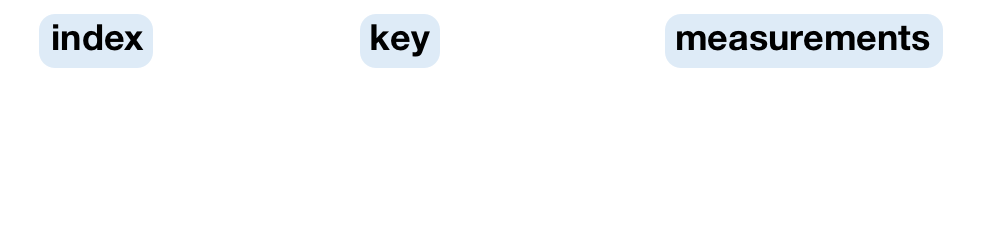

```{r initial, echo = FALSE, cache = FALSE, results = 'hide'}
library(knitr)
options(htmltools.dir.version = FALSE, tibble.width = 60, tibble.print_min = 6)
opts_chunk$set(
  echo = FALSE, warning = FALSE, message = FALSE, comment = "#>",
  fig.path = 'figure/', cache.path = 'cache/', fig.align = 'center', 
  fig.width = 12, fig.height = 8.5, fig.show = 'hold',
  cache = TRUE, dev = 'svglite'
)
read_chunk('scripts/theme.R')
read_chunk('scripts/flights.R')
```

```{r theme-remark}
```

.left-column[
.center[
<br>
<br>
<br>

]
]
.right-column[
<br>
<br>

]

### .center[Behind fluent pipeline is [tidy data](https://tidyr.tidyverse.org/articles/tidy-data.html).]

???

Data analysis is a process, particularly it's an iterative process.

The tidyverse is a collection of R packages to help with this process quick and tidy.

Why it's important? Before deploying the final model into the production stage, we need to repeat this process many many times. If this model doesn't work, we make some tweaks, and then fit another model. We want this iteration as rapid as possible.

In addition to tidy tools, what's underlying this fluent workflow is tidy data.

The "tidy" stage doesn't mean data cleaning, but refers to making the data in a right shape, a uniform shape that is shared by these three stages in this circle.

With the tidyverse, we have such a fluent pipeline to handle data analysis. But when you have time series data and want to do time series analysis ...

---

.left-column[
<br>
<br>
## .center[.red[time series verse]]
]
.right-column[
<br>
<br>

]

### .center[WAT!`r emo::ji("scream")`]

???

This is what you experience. Lots of you in this department primarily focus on the statistical models. But I have been working on the rest of the process to support modelling.

Small data lives in csv files, big data stays in database. But most time, the form of the data at the "import" stage deviates a lot from the current time series objects that are designed for modelling. When doing transformation and visualisation, different data shapes are expected. We do not have a uniform shape for lubricating this process for time series. There's no formal guidance how to reshape the data for modelling purpose.

Screaming out "WAT" is the natural response to this workflow. Let me share my "WAT" moment.

---

background-image: url(img/tsibble-model.png)
background-size: 70%
background-position: 91% 38%

.left-column[
<br>
<br>
<br>
<br>
## .center[tidyver.red[ts]]
]
.right-column[
.animated.slower.rollIn[
.pipeline[]
]
]

### .bottom[.center[Tsibble defines tidier data for temporal analysis.]]

???

So my work is going to smooth out those rough edges, provides a conceptual framework for temporal data analysis, and fill the gap of tidy data in temporal context. We're going to call this new data structure---"tsibble".

You know I'm serious about this work, bc it has a logo.

Next I'm going to demonstrate this whole data process with tsibble and showcase the value of it.

---

class: inverse middle

# .blue[1.] Tsibble is <br> a data abstraction <br> for tidy temporal data.

<hr>



???

Tsibble is a multi-faceted product.

First of all, tsibble represents tidy temporal data.

A tsibble has to be tidy data first. Data is organised in the common rectangular form: each row is an observation; each column holds a variable. But temporal data is more of a contextual data object. So on top of the tidy data, column variables require more meanings: index for time support, key for defining identities over time, and the rest are measurements.

---

class: middle

.top[]

## In *tsibble*:

1. **Index** is a variable with inherent ordering from past to present.
2. **Key** is a set of variables that define observational units over time.
3. Each observation should be uniquely identified by **key** and **index**.

Tsibble is a data- and model-oriented object.

???

Let me elaborate index and key more.

The index variable consists of time indices that provide a contextual basis for temporal data.

A variety of time representations exist in the wild, the common ones you saw before, dates and date-times, as well as intradays and intervals from one time point to another. Tsibble supports all of them, as long as they can be ordered from past to future.

Unlike other time series objects, tsibble respects time zones, will not ignore them and not convert them to UTC. 

Temporal data can be regular and irregularly spaced in time. That's why we say tsibble is temporal data instead of time series.

And the key can consist of empty, one or more variables. It is typically known for analysts. Each observational unit in the key, only allows unique time indices.

These features make tsibble a modern re-imagining temporal data.

---

class: middle

.left-column[
<br>
<br>
<br>
<br>
## .center[`r emo::ji("flight_departure")` `r emo::ji("earth_americas")` `r emo::ji("flight_arrival")`]
]
.right-column[
```{r load-flights}
```
]

???

How the data looks like?

My data is quite simple, with 1000 obs and 2 variables. The `Date` column provides the time context. and how many visitors.

This data starts from the day when I started my PhD until yesterday. It has a sad beginning that nobody visited my website in the early days.

By contrast, airline data contains 5M obs and 22 variables. The `sched_dep_datetime` column gives the date-times. Other variables include the meta info describing the flights and on-time performance metrics. It is an event data set.

They already arrived in the tidy shape, with clearly defined observations and variables. Now we need to declare them as temporal data using tsibble.

---

## Declare a tsibble

.details[
```{r try-tsibble, echo = TRUE, error = TRUE}
```
]

--

## <i class="fas fa-search"></i> duplicates

```{r find-duplicate, echo = TRUE, eval = FALSE}
```

???

How about the airline data?

From the passenger's point of view, we're interested in flight number at its scheduled departure time. Also it's irregular interval.

After declaring key and index. Oops! We got an error.

The error says: ... and suggests ...

Another way to interpret this error message is that this data may have data quality issue.

---

class: middle

```{r highlight.output = c(4, 8)}
flights %>% 
  duplicates(key = flight_num, index = sched_dep_datetime) %>% 
  print(width = 100)
```

???

We need to search for those duplicates and fix them.

As you can see, we've got two problematic entries. The flight number `NK630` has been scheduled twice at the same departure time. They have identical arrival time, departure delay, arrival delay, and carrier. But they are different in tail number, origin and destination. After researching this flight number and going through the whole database, my decision is to remove the highlighted entry: the flight from LAX to DEN, bc this flight doesn't operate on this route.

Tsibble is strict on tidy data.

---

```{r find-duplicate-lgl}
```

```{r tsibble, echo = TRUE}
```

```{r highlight.output = 1:2}
print(flights_ts, width = 70)
```

???

Once we remove the duplicated observation, we are all good.

Irregular time space is marked by exclamation mark. and we've got 22 thousands of flights or series in the table.

---


???

When creating a tsibble object, we're also going through the tidy stage. Tsibble complains early when the data involves duplicates, like the flights data. We need to find the duplicates and fix them. We now end up with a properly-defined temporal data.

Tsibble permits time gaps. It is recommended to check time gaps before transformation and modelling. Bc you are likely to encounter errors if gaps in time. Luckily no gaps in these two data sets.

Tsibble provides formal organisation on how to tidy your temporal data.

---

class: inverse middle

# .blue[2.] Tsibble is <br> a domain specific language in <i class="fab fa-r-project"></i> <br> for wrangling temporal data.

<hr>

.small[.green[
```{r tidyverse, comment = ""}
tidyverse::tidyverse_logo()
```
]]

???

Tsibble is not only a data abstraction, but also a DSL for wrangling temporal data.

Like we can make a plot layer by layer with grammar of graphics, we can chain operation by operation using tsibble to make a complete analysis. Bc the grammar is declarative.

When I actually develop tsibble, I started to appreciate the tidyverse team. Lots of amazing design thinking behind it. A fluent and consistent API gives an intuitive pipeline but it takes lots of time to refine the idea. For example, naminng a thing is difficult.

---

```{r aggregate-week, echo = TRUE}
```

```{r print-carrier-delay, highlight.output = 1:2}
carrier_delay
```

---

## Complain when tsibble cannot hold

.pull-left[
```{r select1, echo = TRUE, message = TRUE}
```
]
.pull-right[
```{r select2, echo = TRUE, error = TRUE}
```
]

---

class: middle

## Tsibble-specific verbs

.pull-left[
### Short-hand
* `index_by()`
* `group_by_key()`
* `filter_index()`
* `append_row()`
]
.pull-right[
### Gap-aware
* `has_gaps()`
* `scan_gaps()`
* `count_gaps()`
* `fill_gaps()`
]

---

class: inverse middle

# .blue[3.] Tsibble rolls with <br> functional programming.

<hr>

### [FP focuses on expressions instead of for-loop statements.](https://en.wikipedia.org/wiki/Functional_programming)

???

The third aspect of tsibble is adopting FP for rolling windows.

When doing rolling window analysis, we cannot avoid for loops. But tsibble's rolling family keeps users away from for loops. and help concentrate on what you're going to achieve instead of how you're going to achieve.

---

## Map and roll

.left-column[
<br>
<br>
<br>
.center[]
]

--

.right-column[
<div style="width:100%;height:0;padding-bottom:64%;position:relative;"><iframe src="https://giphy.com/embed/xoSaxIp8f9JPa" width="100%" height="100%" style="position:absolute" frameBorder="0" class="giphy-embed" allowFullScreen></iframe></div><p><a href="https://giphy.com/gifs/cat-rolls-xoSaxIp8f9JPa"></a></p>
]

???

Another chunk of operations for time series is definitely rolling window. It
not only does iteration over each element like what `purrr::map()` does, but 
also needs to roll. What I'm going to do is to wake up this cat, and let her roll.

---

.pull-left[
```{r for-loop, echo = -1}
options(width = 35)
x <- 1:12
ma_x1 <- double(length = length(x) - 1)
for (i in seq_along(ma_x1)) {
  ma_x1[i] <- mean(x[i:(i + 1)]) #<<
}
ma_x1
mm_x2 <- integer(length = length(x) - 2)
for (i in seq_along(mm_x2)) {
  mm_x2[i] <- median(x[i:(i + 2)]) #<<
}
mm_x2
```
]
.pull-right[
.bottom[
### `r emo::ji("arrow_left")` For loops
]
]

???

A toy example: computing moving averages for window size 2 and median for 3

In order to compute the mean and median, I have to do a bit of setup for the loop. But the only part we're interested is the action: mean and median.

The length of output is not stable, depending on the the choice window size. This is for loop

---

.pull-left[
```{r for-loop, echo = -1}
```
]
.pull-right[
```{r echo = -1}
options(width = 35)
slide_dbl(x, mean, .size = 2)
slide_int(x, median, .size = 3)
```
.bottom[
### `r emo::ji("arrow_up")` Functionals
]
]

???

What I mean by FP? It abstracts away the for-loop, and focus on what you want to do by supplying a function. And it's length-stable and type-stable.

---

.left-column[
<br>
<br>
<br>
## .center[It's a rolling family.]
]
.right-column[
.center[]
]

???

3 types of rolling window

1. sliding: moves a fixed length window through the data with overlapping
2. tiling: moves a fixed length window through the data w/o overlapping
3. stretching: fix an initial window and expand to include more observations.

The animation shows three different rolling averages.

it takes an arbitrary function: simple complex

time series CV: easier to compute forecasting accuracy by comparing rolling forecast with rolling data

...

The only limit for how to use this family for window-related analysis is your imagination. 

---

background-image: url(img/tsibble-model.png)
background-size: 70%
background-position: 91% 38%

.left-column[
<br>
<br>
<br>
<br>
## .center[`r emo::ji("bangbang")`]
]
.right-column[
.animated.slower.rollIn.delay-1s[
.pipeline[]
]
]

### .bottom[.center[Tsibble provides <br> fundamental data infrastructure.]]

???

What's my contribution is:

Tsibble provides a uniform and standardized temporal data structure for downstream analytic tasks. You can easily transform, visualise and model your temporal data, and smoothly shifts between them for rapid iteration to gain data insights.

Tsibble also provides a descriptive grammar that you can express your temporal data analysis problem easily.

Lemme show you a final example to conclude this part by chaining these 3 parts together.

---

class: inverse

.pull-left[
.center[]
]
.pull-right[
<br>
<br>
<br>
# tidyver.red[ts].org
]

???

Last year, I said tsibble was going to be the future of time series. This year, I would say the future is around the corner. A few dependent packages have been developed around the tsibble structure, including the new fable package for forecasting to replace the forecast package. Rob has already started teaching this set of cutting-edge tools in his class this semester. The next generation of forecasters will be more productive.

---

class: middle center

.card[

[slides.earo.me/jsm19](https://slides.earo.me/jsm19)
]

.card[

[tsibble.tidyverts.org](https://tsibble.tidyverts.org)
]

.card[

[otexts.com/fpp3](https://otexts.com/fpp3/)
]
